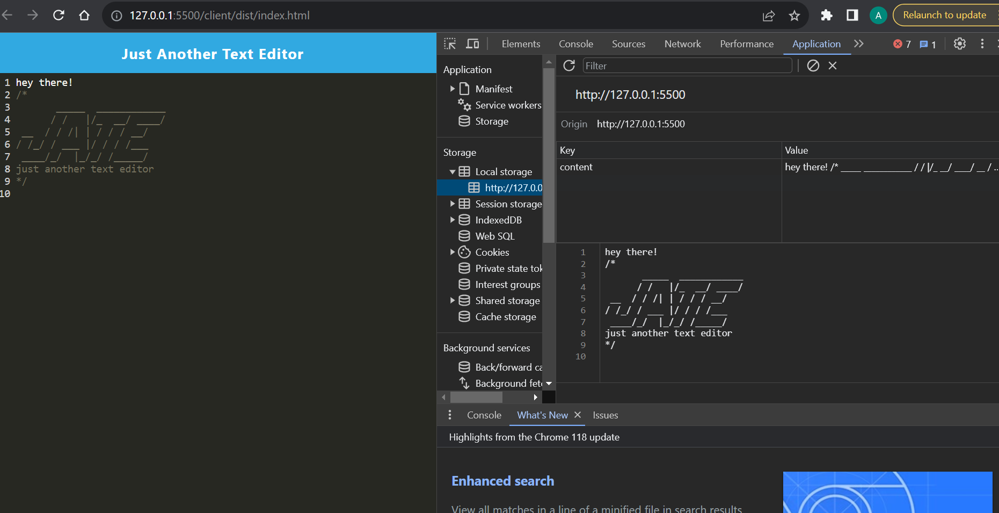

# JATE
A single-page text editor app that runs in the browser that meets the PWA criteria.

# Description
An API for a social network web application where users can share their thoughts, react to friends’ thoughts, and create a friend list.

# Installation
The user will need to have the latest version of node.js downloaded and a Heroku account the user will need to run "npm i" from the command line in order to use this code. The user will also need to run "npm start" from the command line in order to use this code, the app can be run localy by accessing localhost:3001 in the browser.

# Alt text
A screenshot of the deplyed application in Heroku

# Screenshots

# Credits
Help for image webpack output path refrence was utilized from this author - https://github.com/arthurbergmz/webpack-pwa-manifest/issues/23
Heroku deployment help was used from these sites: https://stackoverflow.com/questions/48016683/how-to-delete-heroku-app-and-switch-to-the-new-app-created-from-the-same-files, https://www.npmjs.com/package/heroku

# License
MIT License

Copyright (c) 2023 amattock Permission is hereby granted, free of charge, to any person obtaining a copy of this software and associated documentation files (the "Software"), to deal in the Software without restriction, including without limitation the rights to use, copy, modify, merge, publish, distribute, sublicense, and/or sell copies of the Software, and to permit persons to whom the Software is furnished to do so, subject to the following conditions:

The above copyright notice and this permission notice shall be included in all copies or substantial portions of the Software.

THE SOFTWARE IS PROVIDED "AS IS", WITHOUT WARRANTY OF ANY KIND, EXPRESS OR IMPLIED, INCLUDING BUT NOT LIMITED TO THE WARRANTIES OF MERCHANTABILITY, FITNESS FOR A PARTICULAR PURPOSE AND NONINFRINGEMENT. IN NO EVENT SHALL THE AUTHORS OR COPYRIGHT HOLDERS BE LIABLE FOR ANY CLAIM, DAMAGES OR OTHER LIABILITY, WHETHER IN AN ACTION OF CONTRACT, TORT OR OTHERWISE, ARISING FROM, OUT OF OR IN CONNECTION WITH THE SOFTWARE OR THE USE OR OTHER DEALINGS IN THE SOFTWARE